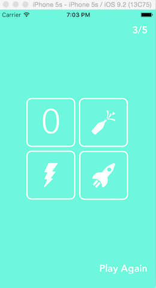

# FizzBuzz using TDD in Swift
As apps are becoming more and more popular and something I would like to work with in the future I wanted to understand how you can TDD in Swift. Previously I have made an app but not using the TDD approach so this is the first time using TDD in Swift.

Yvette, who is a Makers Academy alumni and is a freelance iOS developer has been exploring how to TDD iOS apps using Swift. Using her walk-through has lead me to produce the popular kids game FizzBuzz, but with a using a fully TDD approach in Swift.

#### How Fizzbuzz works
---
You take it in turns to count up to 100(this can be any number you choose, but for this example we will be using 15).

For any number that is divisible by 3 you say 'Fizz',

Any number divisible by 5 you say 'Buzz',

And any number divisible by both 3 and 5 you say 'Fizzbuzz'.
```
1
2
Fizz
4
Buzz
Fizz
7
8
Fizz
Buzz
11
Fizz
13
14
Fizzbuzz
```

### Images
---

 

### Additional Future Features
---
* Setup Play Again button to reset game
* Add a high score feature
* Set a limit to what the user plays up to
* Add a timer

If you would like to give this a try, Yvette's blog with the walk-through can be found [here](https://medium.com/@ynzc/getting-started-with-tdd-in-swift-2fab3e07204b#.11r7my9jm).